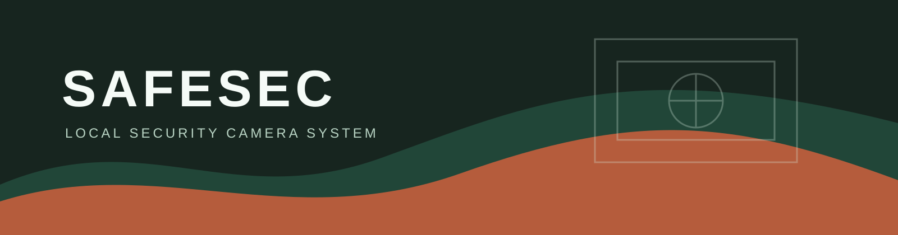

<p align="center">
    
</p>

<p align="center"><strong>Self-hosted security video, detection, recording, and review.</strong><br>Everything runs on your machine or your own edge hardware.</p>

## What it is

SafeSec is an open-source security camera system built for local ownership:

- Live camera or video-file input
- Local MP4 recording with rotating segments and metadata
- Person, dog, and cat detection with configurable labels
- Stable tracking and timestamped detection events
- Browser dashboard with live feed, labels, confidence, and review snapshots
- Local alerts, retention, encryption boundaries, and authenticated device primitives
- Docker packaging for a Linux edge device

The default detector allow-list deliberately excludes irrelevant classes such as umbrellas and hot dogs. See the staged roadmap in [PLAN.md](PLAN.md).

## Quick Start

Requirements: Python 3.11+, [uv](https://docs.astral.sh/uv/), and a webcam or test video.

```powershell
uv sync --extra ml
uv run safesec-local --camera 0 --dashboard --record --recordings .\recordings
```

Open [http://127.0.0.1:8765](http://127.0.0.1:8765). The dashboard shows the live feed, object-name overlays, active tracks, and a timestamped event list. Select an event to review its captured snapshot.

The dashboard binds to localhost by default. Only bind to `0.0.0.0` on a trusted private network; the current dashboard is not an internet-facing authenticated service.

## Video Replay

Run the complete pipeline against a recording without a camera:

```powershell
uv run safesec-local --video tests/walking_in_25fps.mp4 --dashboard --record
```

The sample walking video is 2560x1440 at 25 FPS and replays cleanly through end-of-file. Sample media remains local and is not intended to be committed as product data.

## Detection Controls

Default labels are `person,dog,cat`. Expand the security vocabulary explicitly:

```powershell
uv run safesec-local --camera 0 --labels person,dog,cat,car --dashboard
```

Use a larger model when accuracy matters more than edge-device speed:

```powershell
uv run safesec-local --camera 0 --weights yolo11s.pt --dashboard
```

Fine-tuning is a later step that requires labeled images from the target camera environment. The model remains behind an adapter so its weights and runtime can change without rewriting capture, tracking, recording, or the dashboard.

## Self-Hosted Docker

For a Linux host with a `/dev/video0` camera:

```powershell
docker compose -f infrastructure/docker/compose.yml up --build
```

The compose setup installs the ML backend, maps the camera, exposes the dashboard on port `8765`, and keeps recordings and model weights in local named volumes.

## Development

```powershell
uv run pytest
uv run ruff check .
uv run ruff format --check .
uv run mypy camera detection storage alerts gateway apps
```

The test suite uses fake cameras, model outputs, writers, and dashboard state. It does not require a webcam, GPU, display server, or network model download.

## Architecture

```text
camera/capture       -> Frame values and local camera/video sources
detection/inference  -> model adapter and security label filtering
detection/tracking   -> stable object tracks
storage/segments     -> local MP4 segments and metadata
alerts/rules         -> lifecycle events and notification rules
apps/web             -> local MJPEG dashboard and review snapshots
gateway              -> opt-in authenticated device boundaries
```

Local operation is the default. Camera, model, storage, and transport boundaries are kept separate so RTSP, edge hardware, and production authentication can be added without coupling the core pipeline to a cloud service.

## Security and Licensing

Keep recordings, model weights, credentials, and device secrets out of version control. Review the license of every selected model, weight file, runtime, and dependency before distributing hardware or a packaged product.
